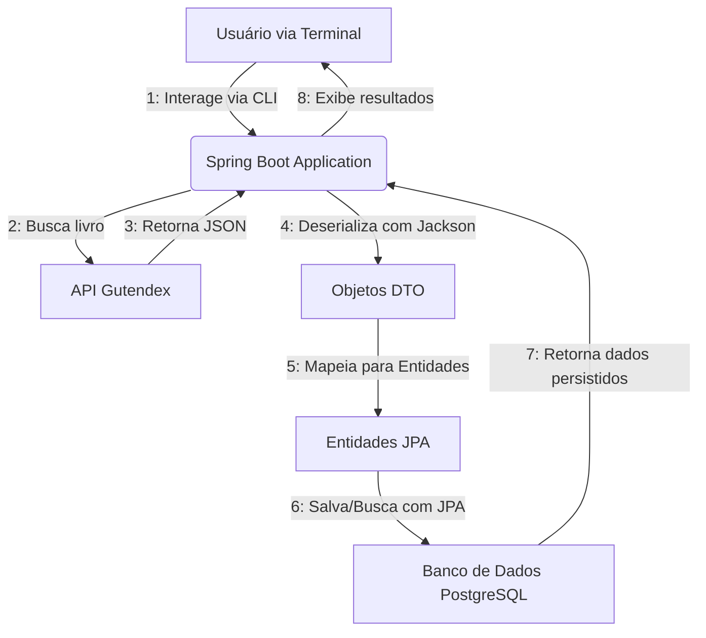

[](https://www.oracle.com/java/) [](https://spring.io/projects/spring-boot) [](https://maven.apache.org/) [](https://www.postgresql.org/)

# 📚 Literallor — Catálogo de Livros

Uma aplicação de terminal em **Java 24** + **Spring Boot 3.x** que consome a API [Gutendex](https://gutendex.com/) para buscar metadados de livros e persistir em um banco **PostgreSQL**. Ideal para quem quer explorar consumo de APIs REST, JPA e interatividade via console.

---

## 📋 Sumário

1. [Visão Geral](#-visão-geral)
2. [Tecnologias](#-tecnologias)
3. [Pré-requisitos](#-pré-requisitos)
4. [Instalação & Configuração](#-instalação--configuração)
5. [Como Executar](#-como-executar)
6. [Uso da Aplicação](#-uso-da-aplicação)
7. [Estrutura do Projeto](#-estrutura-do-projeto)
8. [Diagrama de Arquitetura](#-diagrama-de-arquitetura)
9. [Próximos Passos](#-próximos-passos)

---

## 🔍 Visão Geral

- **Objetivo**: Permitir buscas e gerenciamento de um catálogo de livros a partir do terminal.
- **Fonte de Dados**: API pública gratuita [Gutendex](https://gutendex.com/books/).
- **Persistência**: PostgreSQL via Spring Data JPA.

---

## 🛠 Tecnologias

- **Java 24**
- **Spring Boot 3.x**
- **Maven**
- **Spring Data JPA**
- **PostgreSQL**
- **Jackson** (JSON ↔ Java)
- **Gutendex API**

---

## ⚙️ Pré-requisitos

1. **JDK 21**
2. **Maven 3.x** (ou [Maven Wrapper](https://github.com/takari/maven-wrapper) incluído)
3. **PostgreSQL** em execução

---

## 🚀 Instalação & Configuração

1. **Clone o repositório**

   ```bash
   git clone https://github.com/seu-usuario/literallor.git
   cd literallor
   ```

2. **Crie o banco de dados**

   ```sql
   CREATE DATABASE literallordb;
   ```

3. **Ajuste credenciais** em `src/main/resources/application.properties`

   ```properties
   spring.datasource.url=jdbc:postgresql://localhost:5432/literallordb
   spring.datasource.username=SEU_USUARIO
   spring.datasource.password=SUA_SENHA
   spring.jpa.hibernate.ddl-auto=update   # ou 'validate' em produção
   spring.jpa.show-sql=true
   ```

---

## 🏦 Configuração de Banco de Dados e Ambientes (Profiles)

O projeto é configurado para operar em dois ambientes distintos utilizando **Spring Profiles**, garantindo flexibilidade entre desenvolvimento e produção. A troca de ambiente é feita sem nenhuma alteração no código-fonte.

* ### **Ambiente de Desenvolvimento: `dev` (Padrão)**
   * **Banco de Dados:** **H2 Database** em memória.
   * **Comportamento:** O banco é criado no início da execução e destruído ao final. Ideal para desenvolvimento e testes ágeis, pois não requer instalação ou configuração externa.
   * **Console H2:** Para visualizar e gerenciar o banco de dados em tempo real, acesse `http://localhost:8080/h2-console` no seu navegador após iniciar a aplicação.

* ### **Ambiente de Produção: `prod`**
   * **Banco de Dados:** **MySQL**.
   * **Comportamento:** Conecta-se a um banco de dados persistente, garantindo que os dados sejam mantidos entre as reinicializações da aplicação.
   * **Ação Necessária:** Antes de ativar este profile, é necessário ter uma instância do MySQL ativa e configurar as credenciais de acesso (URL do banco, usuário e senha) no arquivo `src/main/resources/application-prod.properties`.

---

## ▶️ Como Executar

1. No terminal, compile e execute:

   ```bash
   ./mvnw clean install
   ./mvnw spring-boot:run
   ```

2. A aplicação iniciará e apresentará o prompt de comandos no console.

---

## 💻 Uso da Aplicação

A seguir, exemplos de opções de menu no terminal (a implementar):

```
1. Buscar livro por título
2. Listar todos os livros cadastrados
3. Buscar livro por autor
4. Listar autores vivos em ano específico
5. Listar livros por idioma
0. Sair
```

---

## 📂 Estrutura do Projeto

```
.
├── src/
│   ├── main/
│   │   ├── java/com/example/literallor/
│   │   │   ├── LiterallorApplication.java      # Ponto de entrada do Spring Boot
│   │   │   ├── MainApplication.java          # Lógica principal e menu interativo
│   │   │   ├── entity/                       # Entidades JPA (tabelas do banco)
│   │   │   │   ├── Author.java
│   │   │   │   └── Book.java
│   │   │   ├── model/                        # DTOs para desserialização da API
│   │   │   │   ├── AuthorDTO.java
│   │   │   │   ├── BookDTO.java
│   │   │   │   └── GutendexResponseDTO.java
│   │   │   ├── repository/                   # Repositórios Spring Data JPA
│   │   │   │   ├── AuthorRepository.java
│   │   │   │   └── BookRepository.java
│   │   │   └── service/                      # Serviços da aplicação
│   │   │       └── GutendexService.java
│   │   └── resources/
│   │       └── application.properties        # Configurações da aplicação
│   └── test/
│       └── java/com/example/literallor/
│           └── LiterallorApplicationTests.java
├── pom.xml                                     # Build & dependências
└── README.md                                   # Este arquivo

```

---

## 🏛 Diagrama de Arquitetura



---

## 💡 Próximos Passos e Desafios Futuros

- [ ] **Gerar Estatísticas:** Utilizar a classe `DoubleSummaryStatistics` para calcular e exibir dados estatísticos sobre os livros cadastrados (ex: média, máximo e mínimo de downloads).
- [ ] **Top 10 Livros:** Criar uma opção no menu para exibir os 10 livros mais baixados, consultando diretamente o banco de dados.
- [ ] **Buscar Autor por Nome:** Implementar uma busca de autor por nome, consultando o banco de dados local em vez da API.
- [ ] **Consultas Avançadas de Autores:** Expandir as buscas de autores com novas opções, como listar autores por intervalo de ano de nascimento ou falecimento.


---

<p align="center">
  <em>Desenvolvido por Rafael Gomes Silva</em>
</p>
