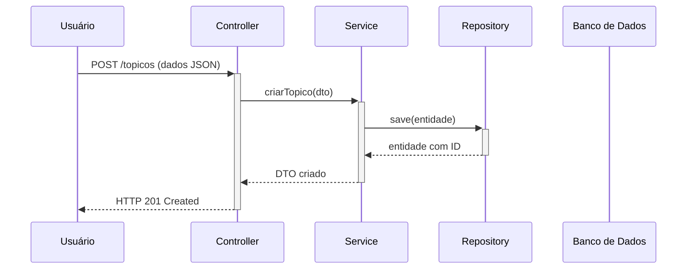

[](https://www.oracle.com/java/) [](https://spring.io/projects/spring-boot) [](https://maven.apache.org/) [](https://www.h2database.com/) [](https://www.mysql.com/)

# Fórum Hub API

Bem-vindo à **API do Fórum Hub**! Este projeto backend segue os princípios REST para uma plataforma de fórum onde usuários podem criar tópicos, interagir com respostas e muito mais.

---

## 📋 Sumário

1. [Tecnologias Utilizadas](#-tecnologias-utilizadas)
2. [Estrutura do Projeto](#-estrutura-do-projeto)
3. [Configuração de Banco de Dados (Profiles)](#-configuração-de-banco-de-dados-profiles)
4. [Diagrama de Fluxo](#-diagrama-de-fluxo)
5. [Como Executar o Projeto](#-como-executar-o-projeto)
6. [Próximos Passos](#-próximos-passos)

---

## 🛠️ Tecnologias Utilizadas

* **Java 24**
* **Spring Boot 3**
* **Spring Web**
* **Spring Data JPA**
* **Spring Security**
* **Maven**
* **Lombok**
* **H2 Database** (Dev)
* **MySQL** (Prod)
* **Bean Validation**

---

## 📁 Estrutura do Projeto

```
forumhub/
├── .mvn/
├── src/
│   ├── main/
│   │   ├── java/
│   │   │   └── com/forumhub/                # Pacote base da aplicação
│   │   │       ├── config/
│   │   │       ├── controller/
│   │   │       ├── dto/
│   │   │       ├── model/
│   │   │       ├── repository/
│   │   │       ├── service/
│   │   │       └── ForumhubApplication.java
│   │   └── resources/
│   │       ├── application.properties      # Configurações gerais
│   │       ├── application-dev.properties  # Profile dev (H2)
│   │       └── application-prod.properties # Profile prod (MySQL)
│   └── test/
└── pom.xml
```

---

## 🏦 Configuração de Banco de Dados e Ambientes (Profiles)

O projeto é configurado para operar em dois ambientes distintos utilizando **Spring Profiles**, garantindo flexibilidade entre desenvolvimento e produção. A troca de ambiente é feita sem nenhuma alteração no código-fonte.

* ### **Ambiente de Desenvolvimento: `dev` (Padrão)**
   * **Banco de Dados:** **H2 Database** em memória.
   * **Comportamento:** O banco é criado no início da execução e destruído ao final. Ideal para desenvolvimento e testes ágeis, pois não requer instalação ou configuração externa.
   * **Console H2:** Para visualizar e gerenciar o banco de dados em tempo real, acesse `http://localhost:8080/h2-console` no seu navegador após iniciar a aplicação.

* ### **Ambiente de Produção: `prod`**
   * **Banco de Dados:** **MySQL**.
   * **Comportamento:** Conecta-se a um banco de dados persistente, garantindo que os dados sejam mantidos entre as reinicializações da aplicação.
   * **Ação Necessária:** Antes de ativar este profile, é necessário ter uma instância do MySQL ativa e configurar as credenciais de acesso (URL do banco, usuário e senha) no arquivo `src/main/resources/application-prod.properties`.

---

## 🔄 Diagrama de Fluxo



---

## ⚙️ Como Executar o Projeto

1. **Clone o repositório**:

   ```bash
   git clone <URL_DO_REPOSITÓRIO>
   cd forumhub
   ```

2. **Execução com profile `dev` (H2)**:

   ```bash
   ./mvnw spring-boot:run
   ```

   A API ficará disponível em `http://localhost:8080`.

3. **Execução com profile `prod` (MySQL)**:

   ```bash
   ./mvnw spring-boot:run -Dspring-boot.run.profiles=prod
   ```

   Ou:

   ```bash
   java -jar target/forumhub-0.0.1-SNAPSHOT.jar --spring.profiles.active=prod
   ```

---

## 🚀 Próximos Passos

* Definir entidade **Tópico** e seu **DTO**.
* Implementar testes unitários com JUnit.
* Adicionar autenticação JWT via Spring Security.
* Configurar persistência em **PostgreSQL** ou outro SGBD.

---

<p align="center">
  <em>Desenvolvido com ♥ por Rafael Gomes Silva</em>
</p>
