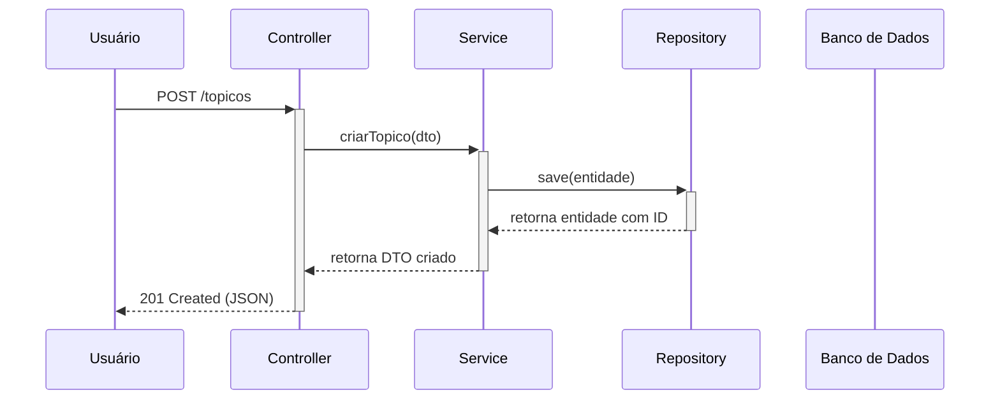

[](https://www.oracle.com/java/) [](https://spring.io/projects/spring-boot) [](https://maven.apache.org/) [](https://www.h2database.com/) [](https://projectlombok.org/)

# 📚 Fórum Hub API

Uma API RESTful de fórum em **Java 24** + **Spring Boot 3**, que permite criar tópicos, responder discussões e gerenciar usuários. Ideal para quem quer aprender boas práticas REST, Spring Data JPA, Spring Security e desenvolvimento backend com Maven.

---

## 📋 Sumário

1. [Visão Geral](#-visão-geral)
2. [Tecnologias](#-tecnologias)
3. [Pré-requisitos](#-pré-requisitos)
4. [Instalação & Configuração](#-instalação--configuração)
5. [Como Executar](#-como-executar)
6. [Estrutura do Projeto](#-estrutura-do-projeto)
7. [Explicação dos Pacotes](#-explicação-dos-pacotes)
8. [Diagrama de Fluxo](#-diagrama-de-fluxo)
9. [Próximos Passos](#-próximos-passos)

---

## 🔍 Visão Geral

* **Objetivo**: Plataforma de fórum backend, onde usuários podem criar tópicos e interagir via respostas.
* **Arquitetura**: API RESTful com Spring Boot e padrões de projeto.
* **Persistência**: Banco em memória H2 para dev, facilmente substituível por outro SGBD.

---

## 🛠 Tecnologias

* **Java 24**
* **Spring Boot 3**
* **Spring Web**
* **Spring Data JPA**
* **Spring Security**
* **Maven**
* **Lombok**
* **H2 Database**
* **Bean Validation**

---

## ⚙️ Pré-requisitos

1. JDK 24 instalado
2. Maven 3.x
3. (Opcional) IDE como IntelliJ ou VS Code

---

## 🚀 Instalação & Configuração

1. **Clone o repositório**

   ```bash
   git clone <URL_DO_REPOSITÓRIO>
   cd forumhub
   ```
2. **Configure variáveis** em `src/main/resources/application.properties`

   ```properties
   # H2 (dev)
   spring.datasource.url=jdbc:h2:mem:forumhubdb
   spring.datasource.driverClassName=org.h2.Driver
   spring.datasource.username=sa
   spring.datasource.password=
   spring.h2.console.enabled=true
   spring.jpa.hibernate.ddl-auto=update
   ```
3. **(Opcional) Altere para outro banco** se necessário.

---

## ▶️ Como Executar

```bash
./mvnw clean install
./mvnw spring-boot:run
```

A API ficará disponível em `http://localhost:8080`.

---

## 📂 Estrutura do Projeto

```
forumhub/
├── src/
│   ├── main/
│   │   ├── java/com/example/forumhub/
│   │   │   ├── config/          # Configurações (Segurança, CORS)
│   │   │   ├── controller/      # Endpoints REST
│   │   │   ├── dto/             # Data Transfer Objects
│   │   │   ├── model/           # Entidades JPA
│   │   │   ├── repository/      # Repositórios Spring Data
│   │   │   └── service/         # Lógica de negócio
│   │   │   └── ForumhubApplication.java
│   │   └── resources/
│   │       └── application.properties
│   └── test/java/com/example/forumhub/
└── pom.xml
```

---

## 📖 Explicação dos Pacotes

* **config**: Classes de configuração (ex.: Spring Security).
* **controller**: Recebe HTTP e delega à camada de serviço.
* **dto**: Objetos para requests/responses, isolando a model.
* **model**: Entidades JPA, representam tabelas do BD.
* **repository**: Interfaces estendendo `JpaRepository`.
* **service**: Regras de negócio e orquestração de repositórios.

---

## 🔄 Diagrama de Fluxo



---

## 🚧 Próximos Passos

* Definir entidade **Tópico** e seu **DTO**.
* Implementar testes unitários com JUnit.
* Adicionar autenticação JWT via Spring Security.
* Persistir em banco relacional (PostgreSQL ou MySQL).

---

<p align="center">
  <em>Desenvolvido com ♥ por Rafael Gomes Silva</em>
</p>
