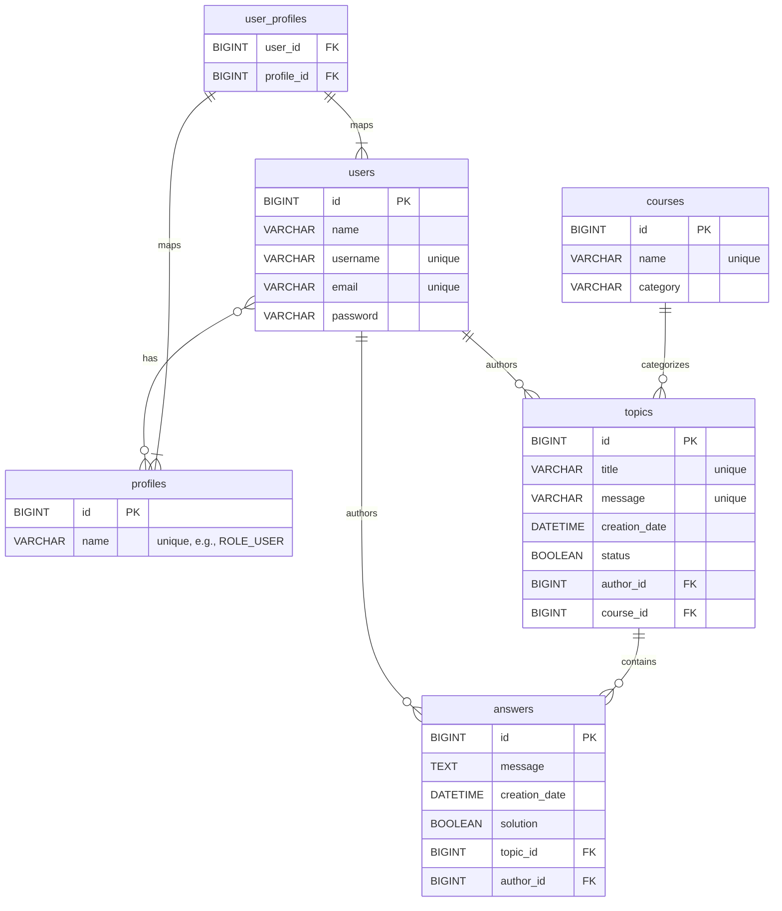
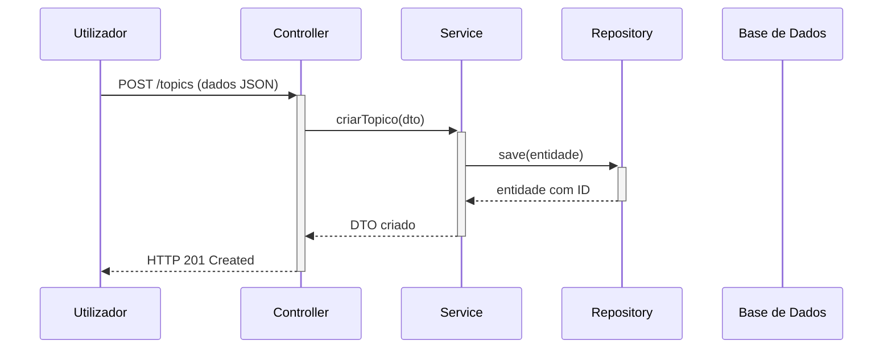

[](https://www.oracle.com/java/) [](https://spring.io/projects/spring-boot) [](https://maven.apache.org/) [](https://www.mysql.com/) [](https://jwt.io/)

# Fórum Hub API

Bem-vindo à **API do Fórum Hub**! Este projeto backend segue os princípios REST para uma plataforma de fórum completa, onde os utilizadores podem registar-se, criar tópicos de discussão, interagir com respostas e muito mais.

---

## 📋 Sumário

1. [Funcionalidades Principais](#-funcionalidades-principais)
2. [Tecnologias Utilizadas](#-tecnologias-utilizadas)
3. [Estrutura do Projeto](#-estrutura-do-projeto)
4. [Esquema da Base de Dados](#-esquema-da-base-de-dados)
5. [Diagrama de Fluxo da API](#-diagrama-de-fluxo-da-api)
6. [Endpoints da API](#-endpoints-da-api)
7. [Configuração e Execução](#-configuração-e-execução)
8. [Próximos Passos](#-próximos-passos)
9. [Autor](#-autor)

---

## ✨ Funcionalidades Principais

* **Autenticação e Registo de Utilizadores**: Sistema seguro de registo de utilizadores e autenticação baseada em JWT para proteger os endpoints.
* **Gestão de Tópicos**: Funcionalidade CRUD (Criar, Ler, Atualizar, Apagar) completa para os tópicos de discussão.
* **Gestão de Respostas**: Funcionalidade CRUD para respostas, incluindo a capacidade de marcar uma resposta como a solução para um tópico.
* **Sistema Baseado em Perfis (Roles)**: Uma estrutura flexível com entidades `User` e `Profile` para suportar futuras regras de autorização.
* **Migrações de Base de Dados**: O esquema da base de dados é gerido de forma limpa e automática com o Flyway.
* **Perfis de Ambiente**: Pré-configurado para ambientes de `dev` (base de dados H2 em memória) e `prod` (base de dados MySQL persistente).

---

## 🛠️ Tecnologias Utilizadas

* **Java 24**
* **Spring Boot 3.5.0**
* **Spring Web** (para APIs RESTful)
* **Spring Data JPA** (para persistência de dados)
* **Spring Security** (para autenticação e segurança)
* **Hibernate** (implementação JPA)
* **MySQL** (Base de dados de produção)
* **H2 Database** (Base de dados de desenvolvimento/teste)
* **Flyway** (para migrações de esquema da base de dados)
* **Lombok** (para reduzir código repetitivo)
* **Maven** (gestão de dependências e build do projeto)
* **java-jwt** (para criação e validação de tokens JWT)
* **Bean Validation** (para validação de dados de entrada)

---

## 📁 Estrutura do Projeto

```bash
forumhub/
└── src/
├── main/
│   ├── java/
│   │   └── com/rafaellor/forumhub/
│   │       ├── config/                # Configs: SecurityConfig, ErrorHandler
│   │       ├── controller/            # Controladores da API REST
│   │       │   ├── AuthenticationController.java
│   │       │   ├── TopicController.java
│   │       │   ├── AnswerController.java
│   │       │   └── UserController.java
│   │       ├── dto/                   # Data Transfer Objects
│   │       ├── model/                 # Entidades JPA (Domínio)
│   │       │   ├── User.java
│   │       │   ├── Profile.java
│   │       │   ├── Course.java
│   │       │   ├── Topic.java
│   │       │   └── Answer.java
│   │       ├── repository/            # Repositórios Spring Data
│   │       └── service/               # Lógica de negócio
│   └── resources/
│       ├── db/migration/              # Scripts de migração Flyway
│       └── application.properties     # Configurações
└── test/                              # Testes unitários e de integração
```

---

## 🗃️ Esquema da Base de Dados



---

## 🔄 Diagrama de Fluxo da API



---

## 🌐 Endpoints da API

| Método | Endpoint               | Autenticação | Descrição                          |
| ------ | ---------------------- | ------------ | ---------------------------------- |
| POST   | /register              | Público      | Regista um novo utilizador         |
| POST   | /login                 | Público      | Autentica utilizador e retorna JWT |
| POST   | /topics                | Requerida    | Cria um novo tópico                |
| GET    | /topics                | Requerida    | Lista todos os tópicos             |
| GET    | /topics/{id}           | Requerida    | Obtém um tópico pelo ID            |
| PUT    | /topics/{id}           | Requerida    | Atualiza um tópico existente       |
| DELETE | /topics/{id}           | Requerida    | Apaga um tópico                    |
| GET    | /topics/{id}/answers   | Requerida    | Lista respostas de um tópico       |
| POST   | /answers               | Requerida    | Cria uma nova resposta             |
| PUT    | /answers/{id}          | Requerida    | Atualiza uma resposta existente    |
| PATCH  | /answers/{id}/solution | Requerida    | Marca resposta como solução        |
| DELETE | /answers/{id}          | Requerida    | Apaga uma resposta                 |

---

## ⚙️ Configuração e Execução

### Pré-requisitos

* Java 24
* Maven
* MySQL instalado e ativo

### Clonar o Repositório

```bash
git clone <URL_DO_SEU_REPOSITÓRIO>
cd forumhub
```

### Configurar MySQL (modo produção)

1. Crie o banco `forumhubdb` no MySQL
2. Edite `application-prod.properties` com as credenciais:

```properties
spring.datasource.username=SEU_USUARIO
spring.datasource.password=SUA_SENHA
```

### Executar em modo `dev` (H2)

```bash
./mvnw spring-boot:run
```

Acesse: [http://localhost:8080](http://localhost:8080) e o console H2: [http://localhost:8080/h2-console](http://localhost:8080/h2-console)

### Executar em modo `prod` (MySQL)

```bash
./mvnw spring-boot:run -Dspring-boot.run.profiles=prod
```

O Flyway aplicará as migrações automaticamente.

---

## 🚀 Próximos Passos

* Adicionar regras de autorização com base no autor
* Implementar paginação nos endpoints de listagem
* Documentar API com Swagger (Springdoc)
* Criar testes automatizados (unitários e integração)

---

## ✍️ Autor

Desenvolvido por **Rafael Gomes Silva**

[LinkedIn](https://www.linkedin.com/in/rafaellor) | [GitHub](https://github.com/rafaelsilvalor)
